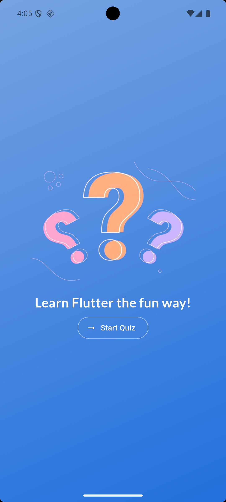
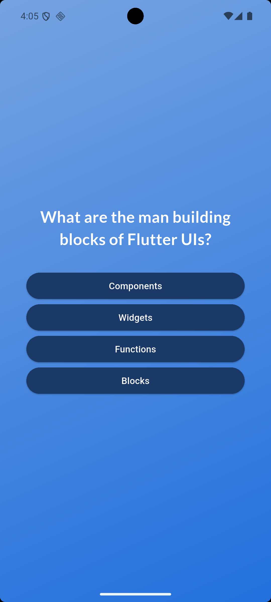
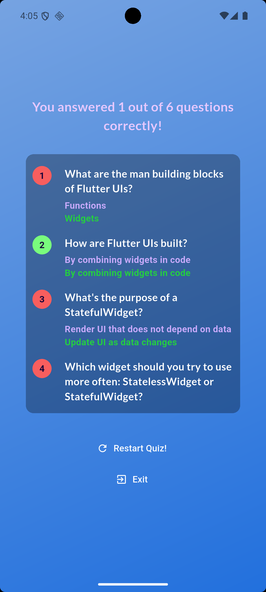

# Quiz App

A simple and interactive quiz application built with Flutter. Test your knowledge with engaging questions and instant feedback!

## Features

- Interactive quiz questions
- Clean and intuitive UI
- Android based
- Instant answer feedback
- Score tracking

## Screenshots

### Mobile App



### Quiz Demo




## Getting Started

### Prerequisites

- Flutter SDK (3.0 or higher)
- Dart SDK
- Android Studio / VS Code
- iOS Simulator / Android Emulator

### Installation

1. Clone the repository

```bash
git clone https://github.com/nazrulf3/quiz_app.git
```

2. Navigate to project directory

```bash
cd quiz_app
```

3. Get dependencies

```bash
flutter pub get
```

4. Run the app

```bash
flutter run
```

## Built With

- **Flutter** - UI framework
- **Dart** - Programming language
- **Material Design** - Design system

## Project Structure

```
lib/
├── main.dart              # App entry point
└── quiz.dart              # Main quiz widget
```

## How to Use

1. Launch the app
2. Read each question carefully
3. Select your answer
4. See your final score!

## Future Enhancements

- [ ] More question categories
- [ ] Difficulty levels
- [ ] Timer per question
- [ ] Leaderboard
- [ ] Custom quiz creation

## Contributing

Contributions are welcome! Please feel free to submit a Pull Request.

## License

This project is open source and available under the [MIT License](LICENSE).

## Author

**Nazrul** - [GitHub Profile](https://github.com/nazrulf3)

## Acknowledgments

- Flutter team for the amazing framework
- Material Design for the design guidelines
